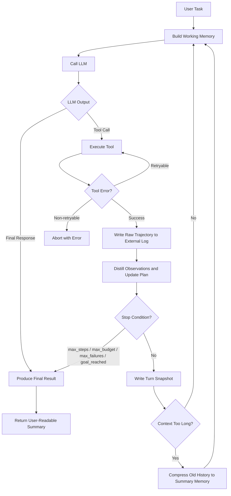

# Harness Foundation

## Purpose
This document records the reusable baseline architecture for our Codex-style agent harness.

## Core Loop (User-Aligned)
1. Receive user task.
2. Build current working memory.
3. Call LLM.
4. Parse LLM output:
   - final response -> produce final result
   - tool call -> execute tool
5. Record raw trajectory to external logs.
6. Distill key observations and update plan.
7. Check context length:
   - if acceptable -> continue next loop
   - if too long -> compress old history into summary memory, then continue
8. Return user-readable summary when done.

## Canonical Flowchart

## Minimal Production Guards
To keep the loop stable, always include:
- stop conditions: goal reached, max steps, max budget, repeated failures
- error routing: retryable vs non-retryable tool failures
- strict output schema before tool execution/final answer
- end-of-turn state snapshot for resume/recovery

## Reuse Rules for This Project
- Put reusable architecture notes and long-lived conventions in `/docs`.
- Prefer small focused docs over one large mixed document.
- Keep this file as the high-level source of truth; link detailed docs from here.

## Linked Docs
- `harness-3-step-plan.md`: phased build plan with scope, deliverables, and acceptance criteria.
- `step1-execution-log.md`: Step 1 implementation baseline and verification notes.
- `step2-reliability-layer.md`: Step 2 reliability decisions, guardrails, and verification notes.
- `uv-local-setup.md`: local Python/venv setup and run commands with `uv`.
- `deepseek-entrypoint.md`: DeepSeek API runtime entrypoint and API-key flow.
- `github-readiness-and-distribution.md`: GitHub publishing checklist and distribution strategy.
